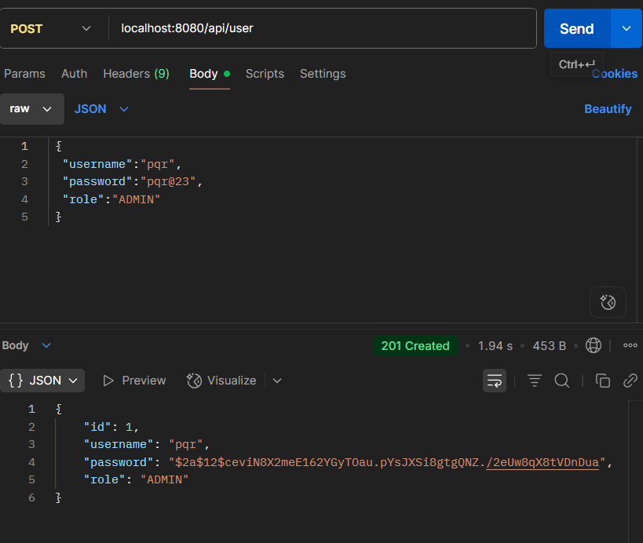
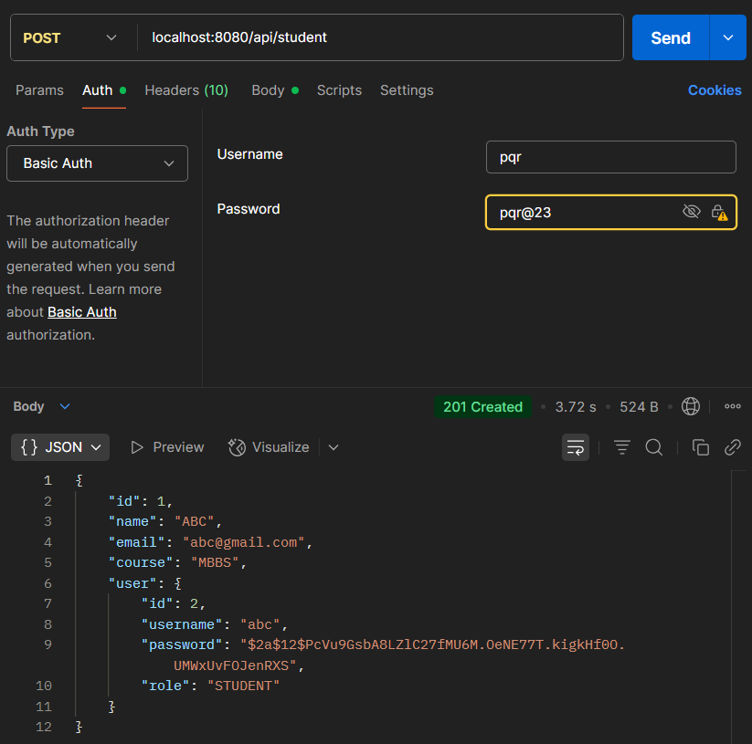
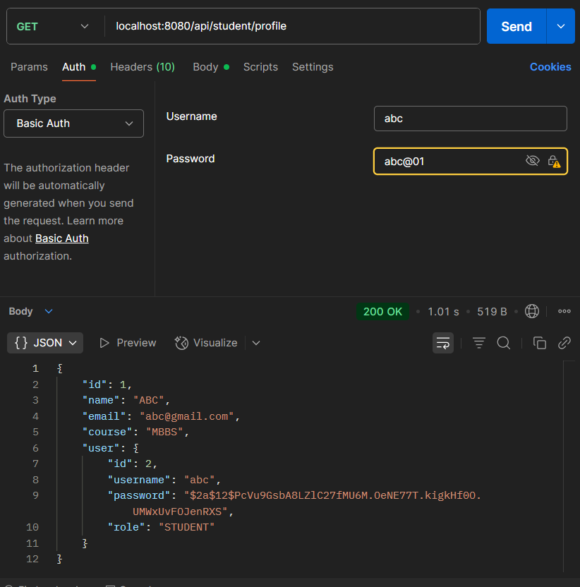
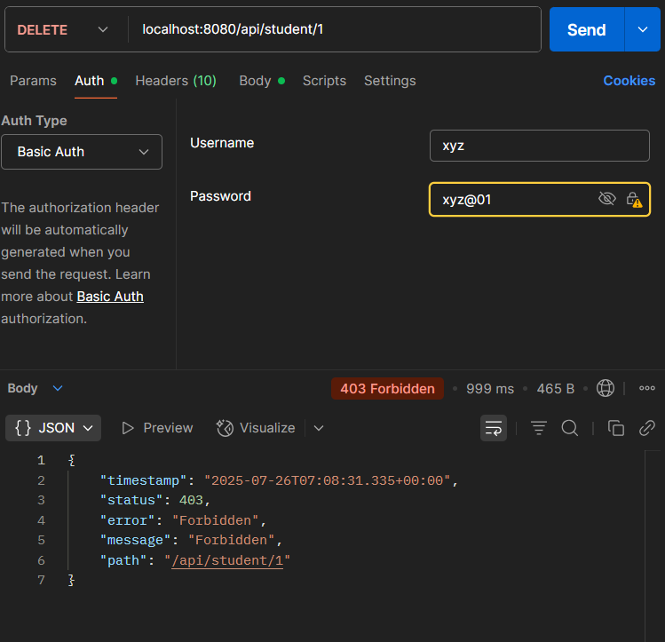
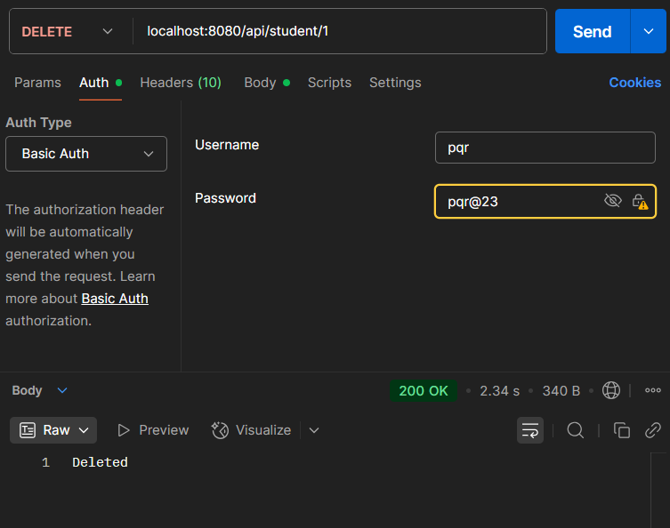

# 🎓 Student Management System (Spring Boot)
-----------------------------------------------------------------------------------------------------------------------------------------------------------------------------------------------------
A role-based RESTful API built with Spring Boot that manages student and user data with security powered by Spring Security and JWT. Includes CRUD operations, secure login, and database persistence.

------------------------------------------------------------------------------------------------------------------------------------------------------------------------------------------------------

🚀 Tech Stack

- Java 17
- Spring Boot
- Spring Security (Role-based auth)
- JWT (planned/placeholder)
- MySQL
- JPA + Hibernate
- Maven

------------------------------------------------------------------------------------------------------------------------------------------------------------------------------------------------------

📂 Project Structure
Student-management/
├── src/
│ ├── main/java/com/Tejas/Student/management/
│ │ ├── configuration/ # Security config
│ │ ├── controller/ # REST Controllers
│ │ ├── model/ # Entity classes
│ │ ├── repo/ # Repository layer
│ │ ├── service/ # Business logic
│ ├── test/ # Unit tests
├── application.properties
├── pom.xml

------------------------------------------------------------------------------------------------------------------------------------------------------------------------------------------------------

🔐 User Roles

- `ADMIN`: Full access to manage students
- `STUDENT`: Can only view their own profile
- Credentials are secured using **BCrypt** hashing

------------------------------------------------------------------------------------------------------------------------------------------------------------------------------------------------------

## 📌 API Endpoints

### 🔑 Public

| Method | Endpoint         | Description         |
|--------|------------------|---------------------|
| POST   | `/api/user`      | Register new user   |
| GET    | `/api/user/{username}` | Get user by username |

------------------------------------------------------------------------------------------------------------------------------------------------------------------------------------------------------

### 👩‍🎓 Student (Admin Only)

| Method | Endpoint            | Description               |
|--------|---------------------|---------------------------|
| GET    | `/api/student`      | Get all students          |
| GET    | `/api/student/{id}` | Get student by ID         |
| POST   | `/api/student`      | Add new student           |
| PUT    | `/api/student`      | Update student            |
| DELETE | `/api/student/{id}` | Delete student (and user) |

------------------------------------------------------------------------------------------------------------------------------------------------------------------------------------------------------

### 👤 Student Profile

| Method | Endpoint              | Description                |
|--------|-----------------------|----------------------------|
| GET    | `/api/student/profile` | Get own profile (STUDENT) |

------------------------------------------------------------------------------------------------------------------------------------------------------------------------------------------------------

🛠️ Configuration

`application.properties`

```properties
spring.application.name=Student-management
spring.datasource.url=jdbc:mysql://localhost:3306/databasename
spring.datasource.username=${DB_USERNAME}
spring.datasource.password=${DB_PASSWORD}
spring.datasource.driver-class-name=com.mysql.cj.jdbc.Driver
spring.jpa.properties.hibernate.dialect=org.hibernate.dialect.MySQL8Dialect
spring.jpa.show-sql=true
spring.jpa.hibernate.ddl-auto=update
```

------------------------------------------------------------------------------------------------------------------------------------------------------------------------------------------------------

## 🖼️ Screenshots

🔹 Add User


🔹 All User


🔹 Add Student Info


🔹 Access Student Profile


🔹 Access Denied


🔹 Delete Student


------------------------------------------------------------------------------------------------------------------------------------------------------------------------------------------------------

🏁 How to Run

📌 Prerequisites:
- Java 17 installed
- MySQL installed and running
- Maven installed

 📦 Steps:
```bash
# 1. Clone the repository
git clone https://github.com/TejasBadgujar001/Student-management.git
cd Student-management

# 2. Set environment variables or modify application.properties
DB_USERNAME=your_mysql_user
DB_PASSWORD=your_mysql_password

# 3. Run the application
./mvnw spring-boot:run
```
------------------------------------------------------------------------------------------------------------------------------------------------------------------------------------------------------

🤝 Author

- 👨‍💻 Tejas Badgujar
- 🔗 [GitHub](https://github.com/TejasBadgujar001)
